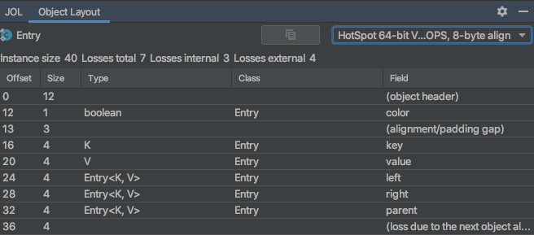
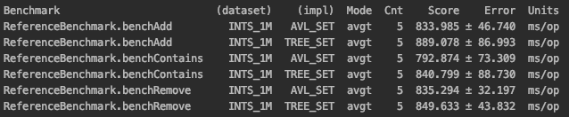
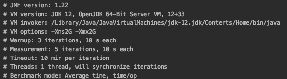

This is an AVL tree based `java.util.NavigableSet` implementation.

> The **AVL tree** is a self-balancing binary search tree named after its two Soviet inventors,
> *Georgy Adelson-Velsky* (on the right) and *Evgenii Landis* (on the left), who published it in their 1962 paper
> *"An algorithm for the organization of information"*. It was the first such data structure to be invented.
> 
> In an AVL tree, the heights of the two child subtrees of any node differ by at most one; if at any time they differ
> by more than one, rebalancing is done to restore this property. 
> Lookup, insertion, and deletion all take `O(log n)` time in both the average and worst cases, 
> where `n` is the number of nodes in the tree prior to the operation. 
> Insertions and deletions may require the tree to be rebalanced by one or more tree rotations.
> 
> AVL trees are often compared with red–black trees because both support the same set of operations
> and take `O(log n)` time for the basic operations. 
> For lookup-intensive applications, AVL trees are faster than red–black trees because they are more strictly balanced.
> Similar to red–black trees, AVL trees are height-balanced.

    

source: https://en.wikipedia.org/wiki/AVL_tree

#### Compared with the reference `TreeSet` implementation

##### Memory

`java.util.TreeSet` is a red-black tree based `NavigableSet` implementation that reuses the `TreeMap` implementation code 
by working with an `EntrySet` filled with dummy object references as values which yields an overhead of 
extra 8 bytes for each node of the tree.  
`AvlTree`'s internal `Node` implementation doesn't have such overhead and is thus 8 bytes lighter.

`TreeMap.Entry`
- with compressed pointers: `40 bytes`  
- no compressed pointers: `64 bytes`  

`AvlSet.Node`  
- with compressed pointers: `32 bytes`  
- no compressed pointers: `56 bytes`  

##### Performance

Here's a quick JMH benchmark covering the basic set of operations (`add`/`contains`/`remove`)
against the very same dataset of `1 million` random integers:  

Roughly `AvlSet` is `2 - 7`% faster across the board which is negligible. 

Benchmark parameters:
- CPU: 2,7 GHz Quad-Core Intel Core i7
- MEM: 16 GB 2133 MHz LPDDR3
- JMH params  
  
- Source: [ReferenceBenchmark.java](src/test/java/com/github/sabirove/util/ReferenceBenchmark.java)

###### TODO
- "subset view" family of APIs (`descendingSet`, `subSet`, `tailSet`, `headSet`) is not implemented for now
- no `ConcurrentModificationException` safeguard implemented for now
